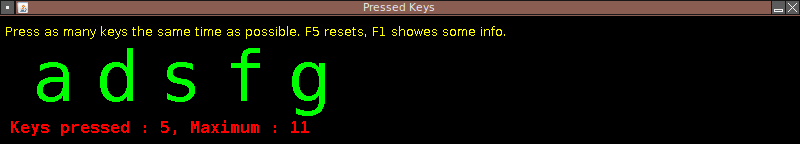

Beschreibung
============

Pressed Keys ist ein kleines, graphisches Java Programm, welches es ermöglicht,
festzustellen, wie viele Tastatureingaben maximal gleichzeitig an den Computer
übertragen werden. Die Anzahl der gleichzeitig drückbaren Tasten ist für manche
Computerspiele sehr wichtig und kann mit diesem Programm schnell und einfach
ermittelt werden.

Bitte beachten: Das Programm ist von 2009, also schon etwas „alt“. Es erfüllt
seinen hauptsächlichen Zweck recht gut, bessere Programme für den selben Zweck
sind aber bei anderen „Anbietern“ verfügbar!

Inbetriebnahme
==============

Abhängigkeiten: Ant und ein JDK (bis Java 8 incl. getestet).

 1. Kompilieren mit `ant jar`
 2. Ausführen mit `java -jar pressed_keys.jar`

Ein Debian-Package `mdvl-pressed-keys` kann per `ant package` generiert werden,
wenn die benötigten Abhängigkeiten zum Erstellen von Debian Packages vorhanden
sind.
